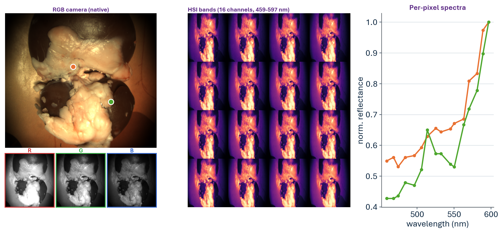
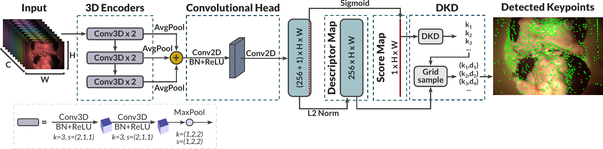
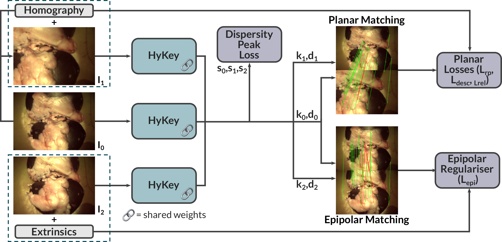
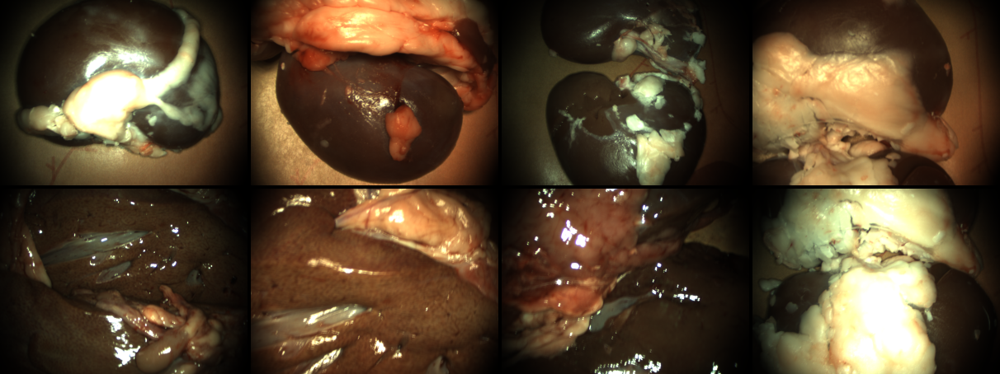
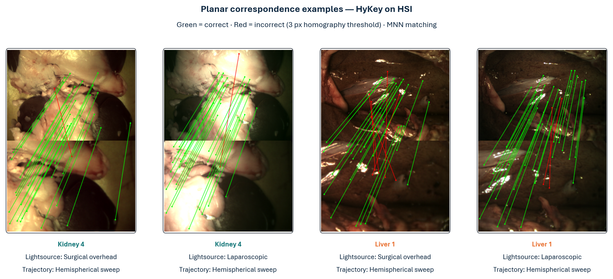
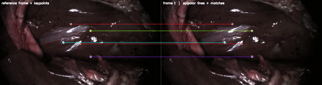

<p align="center">
  <h1 align="center">IPCAI 2026: HyKey - Hyperspectral Keypoint Detection and Matching in Minimally Invasive Surgery</h1>
  <p align="center">
    <strong>Alexander Saikia</strong>
    &nbsp;·&nbsp;
    <strong>Chiara Di Vece</strong>
    &nbsp;·&nbsp;
    <strong>Zhehua Mao</strong>
    &nbsp;·&nbsp;
    <strong>Sierra Bonilla</strong>
    &nbsp;·&nbsp;
    <strong>Chloe He</strong>
    &nbsp;·&nbsp;
    <strong>Joao Ramalhinho</strong>
    &nbsp;·&nbsp;
    <strong>Tobias Czempiel</strong>
    &nbsp;·&nbsp;
    <strong>Sophia Bano</strong>
    &nbsp;·&nbsp;
    <strong>Danail Stoyanov</strong>
  </p>
  <h3 align="center"><a href="https://link.springer.com/article/10.1007/s11548-026-03633-z">Paper</a> | <a href="https://doi.org/10.5522/04/32793294">Dataset & Weights</a></h3>
  <div align="center"></div>
</p>

<p align="center">
  
</p>

## Abstract
### Purpose
3D reconstruction in minimally invasive surgery (MIS) enables enhanced surgical guidance through improved visualisation, tool tracking, and augmented reality. However, traditional RGB-based keypoint detection and matching pipelines struggle with surgical challenges, such as poor texture and complex illumination. We investigate whether using snapshot hyperspectral imaging (HSI) can provide improved results on keypoint detection and matching surgical scenes.

### Methods
We developed HyKey, a hyperspectral keypoint detection and description model made up of a hybrid 3D-2D convolutional neural network that jointly extracts spatial-spectral features from HSI. The model was trained using synthetic homographic augmentation and epipolar geometry constraints on a robotically acquired dual-camera RGB-HSI laparoscopic dataset of ex vivo organs with calibrated camera poses. We benchmarked performance against established RGB-based methods, including SuperPoint and ALIKE.

### Results
Our HSI-based model outperformed RGB baselines on registered RGB frames, achieving 96.62% mean matching accuracy and 67.18% mean average accuracy at 10
 on pose estimation, demonstrating consistent improvements across multiple evaluation metrics.

### Conclusion
Integrating spectral information from an HSI cube offers a promising approach for robust monocular 3D reconstruction in MIS, addressing limitations of texture-poor surgical environments through enhanced spectral-spatial feature discrimination.

<p align="center">
  
</p>

---

## ⚙️ Installation

```bash
git clone https://github.com/alexsaikia/HyKey-Hyperspectral-Keypoint-Detection
cd HyKey-Hyperspectral-Keypoint-Detection
python -m venv .venv && source .venv/bin/activate

# Install PyTorch FIRST, matching your GPU driver's CUDA version. A bare `pip install torch`
# pulls the newest CUDA build, which is often too new for an existing driver (you'll see a
# "CUDA driver too old" error at runtime). Pick the wheel for your CUDA from pytorch.org;
# e.g. for a CUDA 12.1 driver:
pip install torch --index-url https://download.pytorch.org/whl/cu121

pip install -r requirements.txt
```

Tested with Python 3.11 and PyTorch 2.4 (CUDA 12.1). A GPU is recommended for training; inference runs on CPU. To check your driver's CUDA version run `nvidia-smi` (top-right "CUDA Version").

---

## 🔬 Method

HyKey is a hybrid 3D-2D CNN tailored to hyperspectral input. Given an HSI cube `I ∈ R^(C×H×W)` (with `C = 16` bands in our system), the network (i) detects a set of repeatable keypoints and (ii) computes L2-normalised local descriptors, so that correspondences between views can feed standard geometric estimators (homography, essential/fundamental matrix) for 3D reconstruction and camera tracking in MIS scenes. The 3D convolutions capture spectral-spatial correlations early, while a lightweight 2D head produces a keypoint score map and dense descriptors at full image resolution. This design is preferred over transformer-heavy alternatives because surgical HSI training data are scarce and real-time constraints make large transformers impractical in the operating room.

<p align="center">
  
</p>

**3D spectral-spatial encoder.** The cube passes through three 3D convolution blocks. Each block contains two 3×3×3 convolutional layers with stride `(2,1,1)` (halving the spectral bands at each convolution) and outputs `c_i` channels (`c_1 = 32`, `c_2 = 64`, `c_3 = 128`), followed by a `(1,2,2)` spatial max-pool. Each block therefore produces an output of shape `[c_i, C_in/4, H_in/2, W_in/2]`.

**Feature aggregation.** The three encoder outputs are average-pooled across the spectral dimension (collapsing it to a single channel), then bilinearly upsampled to the original spatial resolution and concatenated along channels, giving an aggregated feature block `F ∈ R^((c_1+c_2+c_3)×H×W)`.

**2D convolutional head.** Two 3×3 convolutions are applied to `F`. The first produces `D` channels and is followed by batch normalisation and ReLU; the second produces `D+1` channels, split into a score map `S` (sigmoid activation) and a `D`-channel descriptor map, with descriptors L2-normalised per pixel.

**Differentiable keypoint detection.** The score map `S` feeds a DKD module (ALIKE/ALIKED-style) that performs differentiable keypoint extraction via soft selection within a local window, rather than non-differentiable NMS. This preserves gradient flow for end-to-end training of the encoder, head, and detection stages. Descriptors are obtained by grid-sampling the descriptor map at each keypoint location.

The model is trained with synthetic planar-homography supervision plus an epipolar (geometry-aware) term from real subsequent frames, as illustrated below.

<p align="center">
  
</p>

---

## 💾 Dataset

Download the HyKey Dataset and extract it to `data/spectral/`. No preprocessing step is needed; the dataset ships with calibration and poses pre-computed.

> **Download:** [https://doi.org/10.5522/04/32793294](https://doi.org/10.5522/04/32793294) (DOI: `10.5522/04/32793294`)

<p align="center">
  
</p>

*Ex-vivo ovine kidneys and livers, laparoscopic and surgical lighting, hemispherical-sweep and trocar trajectories.*

### Data structure

```
data/spectral/
├── calibration/                    # shared camera calibration (ships with the dataset)
│   ├── RGB/calibration_data.xml    # RGB intrinsics + hand-eye extrinsics
│   ├── HSI/calibration_data.xml    # HSI intrinsics + hand-eye extrinsics
│   ├── stereo_calibration.xml      # RGB<->HSI stereo extrinsics
│   └── homographies/               # RGB<->HSI registration homographies
│       ├── H_hsi2rgb.npy
│       └── H_rgb2hsi.npy
├── K4_lap_close_acquisition_2024-08-28_22-48-52/
│   ├── HSI/00000000.npy ...        # raw XIMEA hyperspectral mosaics
│   ├── RGB/00000000.npy ...        # raw RGB frames
│   ├── hsi_poses.csv               # hand-eye-calibrated HSI camera poses
│   ├── rgb_poses.csv               # hand-eye-calibrated RGB camera poses
│   ├── frame_log.csv               # exposure times + raw robot poses
│   ├── white_*.npy                 # radiometric white reference
│   └── dark_*.npy                  # radiometric dark reference
└── HE_calib_*_acquisition_<timestamp>/   # raw ChArUco calibration captures (only needed to recalibrate; see docs/RECALIBRATION.md)
```

Calibration lives inside the dataset root, so it is loaded automatically as `<spectral_data_root>/calibration` (override with the `calibration_dir` config key if needed). The `HE_calib_*` folders are the raw calibration captures used to produce `calibration/`; they are not needed for training/evaluation/inference and are skipped by the data loader.

### Naming conventions

Folder names: `{organ}_{lighting}_{trajectory}_acquisition_<timestamp>`

| Field | Tag | Meaning |
|---|---|---|
| **Organ** | `K1`-`K4` | Ovine kidney, 2024-08-28 (train/val/test) |
| | `K5`-`K7` | Ovine kidney, 2024-08-16 (train only) |
| | `L1`-`L2` | Ovine liver, 2024-08-28 (train/test) |
| | `L3` | Ovine liver, 2024-08-16 (train only) |
| **Lighting** | `lap` | Laparoscopic light only |
| | `surg` | Surgical overhead lights |
| **Trajectory** | `close` | Hemispherical sweep, close range (~10-15 cm) |
| | `far` | Hemispherical sweep, extended range (~20-30 cm) |
| | `trocar` | Trocar (RCM) trajectory |

**Splits** (`configs/test_set.yaml`, `configs/validation_set.yaml`): test = `K4_*` + `L1_*`; val = `K2_*`; K5-K7 and L3 are training only.

---

## 🏋️ Training

```bash
python -m train.train_hykey --config configs/train_hykey.yaml
```

Key options in `configs/train_hykey.yaml`: `spectral_data_root`, epipolar loss weight `w_epi`, `radiometric_calibration`, batch size, epochs.

**Synthetic-warp difficulty.** The planar-homography augmentation strength is controlled by `warp_difficulty` in the `dataset:` block (defaults to `paper`, the setting the released checkpoints were trained/evaluated under):

```yaml
dataset:
  warp_difficulty: paper      # 'paper' (default) | 'harder' | or inline overrides below
```

- Switch presets by name: `warp_difficulty: harder` for the harder post-paper settings.
- Override individual parameters from the config without editing code, e.g.:
  ```yaml
  dataset:
    warp_difficulty: paper
    warp_params: { max_angle: 0.35, scaling_amplitude: 0.08 }   # merged on top of the preset
  ```
- The presets themselves live in `data_processing/utils/augmentation_utils.py` (`WARP_PRESETS`); edit there to redefine `paper`/`current` or add your own. Parameters: `scaling_amplitude`, `perspective_amplitude_x`, `perspective_amplitude_y`, `patch_ratio`, `max_angle`.

---

## 📊 Evaluation

```bash
python evaluate_hykey.py --config configs/evaluate_hykey.yaml
```

Reports planar MMA (pixel thresholds) and relative-pose mAA (degree thresholds). Set checkpoint dir under `evaluation.model_checkpoint_dirs`.

<p align="center">
  
</p>

---

## 🔍 Inference

```bash
python infer_pair.py \
    --acquisition ./data/spectral/K4_lap_close_acquisition_2024-08-28_22-48-52 \
    --checkpoint ./checkpoints/hykey \
    --idx 0 --pair planar --output matches.png
```

`--pair planar` uses a synthetic homography warp; `--pair nonplanar` uses a real subsequent frame.

<p align="center">
  
</p>

---

## 🎛️ Checkpoints

The default model ships bundled with the [HyKey Dataset](https://doi.org/10.5522/04/32793294) - extracting the dataset places it under `checkpoints/hykey/`, holding `hykey.ckpt` and the training `config.yaml` (so the exact architecture is rebuilt on load).

| Checkpoint | Input | Epipolar | Recipe / notes |
|---|---|---|---|
| `hykey` | raw HSI | yes | **Default** |


**More model weights will be released here soon.** As each becomes available, download it and copy it into its own subfolder under `checkpoints/` (e.g. `checkpoints/<name>/`), then point `evaluation.model_checkpoint_dirs` in `configs/evaluate_hykey.yaml` at that folder.

---

## 🔧 Calibration

Pre-computed calibration ships inside the dataset under `data/spectral/calibration/`. **No recalibration step is needed to run the dataset.** It is loaded automatically as `<spectral_data_root>/calibration` (override via the `calibration_dir` config key).

If you want to recalibrate for your own hardware (or reproduce `calibration/` from the raw `HE_calib_*` ChArUco captures shipped with the dataset), see **[docs/RECALIBRATION.md](docs/RECALIBRATION.md)**.

---

## 📝 Citation

```bibtex
@article{saikia2026hykey,
  title   = {HyKey: Hyperspectral Keypoint Detection and Matching in Minimally Invasive Surgery},
  author  = {Saikia, Alexander and Di Vece, Chiara and Mao, Zhehua and Bonilla, Sierra and
             He, Chloe and Ramalhinho, Joao and Czempiel, Tobias and Bano, Sophia and
             Stoyanov, Danail},
  journal = {International Journal of Computer Assisted Radiology and Surgery},
  year    = {2026},
  note    = {IPCAI 2026}
}
```

```bibtex
@article{saikia2025robotic,
  title     = {Robotic Arm Platform for Multi-View Image Acquisition and 3D Reconstruction
               in Minimally Invasive Surgery},
  author    = {Saikia, Alexander and Di Vece, Chiara and Bonilla, Sierra and He, Chloe and
               Magbagbeola, Morenike and Mennillo, Laurent and Czempiel, Tobias and
               Bano, Sophia and Stoyanov, Danail},
  journal   = {IEEE Robotics and Automation Letters},
  year      = {2025},
  publisher = {IEEE}
}
```

---

## License

Code, HyKey Dataset, and weights are released under **CC BY-NC 4.0**. See [LICENSE](LICENSE). For commercial use, contact the authors.
